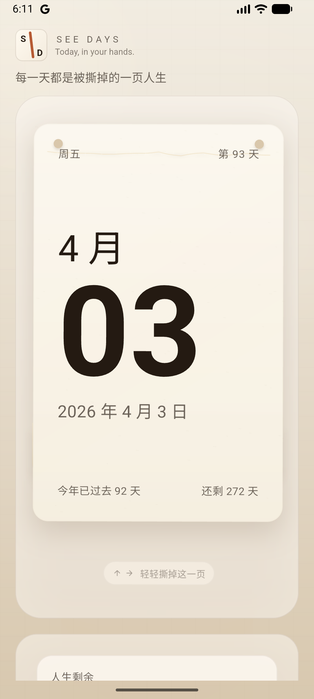
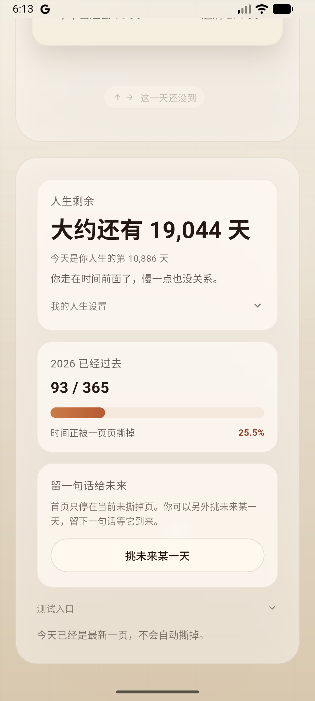

# See Days

Every day is a page.  
Tear yesterday. See today.

See Days is a tactile calendar app built with Flutter. It recreates the feeling of tearing a real paper calendar: each day is a physical page, each page can be torn away, crumpled into a paper ball, and thrown out of sight.

The product is designed as a calm object about time passing, not as a productivity app.

## Live

- Web: [https://seedays.laosji.net](https://seedays.laosji.net)

## Screenshots

### Home



### Life And Progress



## Platforms

- Web / PWA
- Android
- iPhone / iPad
- Windows desktop

## Core Experience

- One page represents one day of the current year
- The home screen always shows the current page you have not torn yet
- You can tear today, or keep tearing into the future like a real paper calendar
- When a page is torn, it does not return to the main card
- Future pages can hold a short note; if you tear that page early, the note disappears with it
- The remaining stack gets thinner over time

## Tone

- calm
- reflective
- tactile
- slightly bittersweet

## Project Structure

- Flutter app entry: [`lib/main.dart`](./lib/main.dart)
- Web app shell: [`web/index.html`](./web/index.html)
- Web manifest: [`web/manifest.json`](./web/manifest.json)
- Windows runner: [`windows`](./windows)

## Run Locally

```bash
flutter pub get
flutter run
```

## Build Web

```bash
flutter build web
```

## Windows Installer

This repo includes a GitHub Actions workflow that can build a Windows desktop package and create a distributable installer executable.

After pushing the repo to GitHub, use the workflow:

- `Build Windows Installer`

It will generate a release artifact named:

- `SeeDaysSetup.exe`

## Help Wanted

Contributions are welcome.

The area that most needs help right now is the tactile motion quality of the tear sequence, especially:

- making the torn page crumple more like real paper
- improving the paper ball material realism
- making the paper ball slam into the screen feel heavier, sharper, and more believable

If you are strong in:

- Flutter motion systems
- custom painting / deformation
- physics-feel interaction design
- paper material rendering

please open an issue or PR.

This project would benefit most from help on the paper-ball-to-screen-impact effect.

## Install As Desktop App

On Chrome or Edge, the web version can be installed as a desktop app from:

- [https://seedays.laosji.net](https://seedays.laosji.net)

## License

MIT
